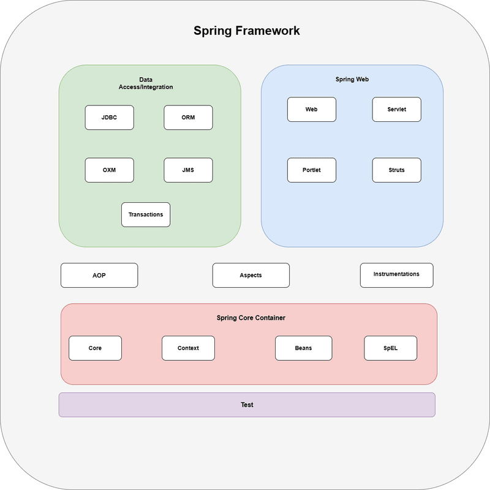

- Spring Framework is a comprehensive and versatile platform for enterprise Java development.
- Spring is a lightweight and popular open-source Java-based framework developed by Rod Johnson in 2003.
- It is known for its Inversion of Control (IoC) and Dependency Injection (DI) capabilities 
  that simplify creating modular and testable applications.
- Key features include Spring MVC for web development, Spring Boot for rapid application setup, 
  and Spring Security for robust authentication and authorization. 
- The spring contains several modules like IOC, AOP, DAO, Context, WEB MVC, etc.

### Features of the Spring Framework
1. Inversion of Control (IoC) container
2. Data access framework
3. Spring MVC framework
4. Transaction management
5. Spring Web Service
6. JDBC abstraction layer
7. Spring TestContext framework

- The Spring framework consists of seven modules: 
1. Spring Core
2. Spring AOP
3. Spring Web MVC
4. Spring DAO
5. Spring ORM
6. Spring context
7. Spring web flow

### 1. Spring Core module
- provides the IoC container
- There are two types of implementations of the Spring container, namely, bean factory and application context. 
- Bean factory is defined using the org.springframework.beans.factory.BeanFactory interface and acts as a container for beans.
- The Bean factory container allows you to decouple the configuration and specification of dependencies from program logic.
- In the Spring framework, the Bean factory acts as a central IoC container that is responsible for instantiating application objects.
- It also configures and assembles the dependencies between these objects. 
- The XmlBeanFactory class is the most common implementation of the BeanFactory interface. 
- This allows you to express the object to compose your application and remove interdependencies between application objects.

### 2. Spring AOP Module (Aspect Oriented Programming)
- Similar to OOP, which breaks down the applications into hierarchy of objects, AOP breaks down the programs into aspects or concerns.
- The aspects are the regular Spring beans or regular classes annotated with @Aspect annotation.
- These aspects help in transaction management and logging and failure monitoring of an application. i.e
  Transaction management is required in bank operations such as transferring an amount from one account to another 
  Spring AOP module provides a transaction management abstraction layer that can be applied to transaction APIs.

### 3. Spring ORM Module
- The Spring ORM module is used for accessing data from databases in an application. 
- It provides APIs for manipulating databases with JDO, Hibernate, and iBatis.
- Spring ORM supports DAO, which provides a convenient way to build the following DAOs-based ORM solutions:
 * Simple declarative transaction management
 * Transparent exception handling
 * Thread-safe, lightweight template classes
 * DAO support classes
 * Resource management

### 4. Spring Web DAO Module
- The DAO package in the Spring framework provides DAO support by using data access technologies such as JDBC, Hibernate, or JDO.
- This module introduces a JDBC abstraction layer by eliminating the need for providing tedious JDBC coding.
- It also provides programmatic as well as declarative transaction management classes.
- Spring DAO package supports heterogeneous Java Database Connectivity and O/R mapping, 
  which helps Spring work with several data access technologies.
- For easy and quick access to database resources, the Spring framework provides abstract DAO base classes.
- Multiple implementations are available for each data access technology supported by the Spring framework.
- For example, in JDBC, the JdbcDaoSupport class and its methods are used to access the DataSource instance and a preconfigured JdbcTemplate instance. 
- You need to simply extend the JdbcDaoSupport class and provide a mapping to the actual DataSource instance in an application context configuration 
  to access a DAO-based application.

### 5. Spring Web MVC Module
- The Web MVC module of Spring implements the MVC architecture for creating Web applications.
- It separates the code of model and view components of a Web application.
- Explanation (process flow):
  when a request is generated from the browser, it first goes to the DispatcherServlet class (Front Controller),
  which dispatches the request to a controller (SimpleFormController class or AbstractWizardformController class) using a set of handler mappings.
  The controller extracts and processes the information embedded in a request and sends the result to the DispatcherServlet class 
  in the form of the model object.
  Finally, the DispatcherServlet class uses ViewResolver classes to send the results to a view, which displays these results to the users.

### 6. Spring Web Flow Module
- The Spring Web Flow module is an extension of the Spring Web MVC module.
- Spring Web MVC framework provides form controllers, such as class SimpleFormController and AbstractWizardFormController class, 
  to implement predefined workflow. 
- The Spring Web Flow helps in defining XML file or Java Class that manages the workflow between different pages of a Web application.
- Advantages of Spring Web Flow:
  * The flow between different UIs of the application is clearly provided by defining Web flow in XML file.
  * Web flow definitions help you to virtually split an application in different modules and reuse these modules in multiple situations.

### 7. Spring Application Context Module
- The Spring Application context module is based on the Core module.
- Application context org.springframework.context.ApplicationContext is an interface of BeanFactory.
- This module derives its feature from the org.springframework.beans package and also supports functionalities such as 
  internationalization (I18N), validation, event propagation, and resource loading.
- The Application context implements MessageSource interface and provides the messaging functionality to an application.

### Spring Framework Architecture
- Its architecture is designed around two core principles: Dependency Injection (DI) and Aspect Oriented Programming (AOP)
- The Spring framework consists of several modules, which can be categorized into four main areas: 
  * Core Container
  * Data Access/Integration
  * Web
  * Miscellaneous

- The Core Container provides the fundamental functionality of the Spring framework, including the IoC container and ApplicationContext.
- The Data Access/Integration area provides support for integrating with databases and other data sources.
- The Web area provides support for building web applications, including the Spring MVC and Spring WebFlux modules.
- The Miscellaneous area includes other modules that provide additional functionality, such as the Spring Security module for authentication 
  and authorization features.

### Dependency Injection (DI)
- Is a design pattern that helps to reduce the coupling between the components of an application.
- By using DI, the Spring framework enables loose coupling between components, making the application more modular and easier to maintain.
- The Spring framework provides an Inversion of Control (IoC) container, which is responsible for creating and managing instances of JavaBeans, 
  and the ApplicationContext, which provides a unified view of the entire application configuration.

### Aspect-Oriented Programming (AOP)
- Allows developers to modularize cross-cutting concerns, such as logging, security, and transaction management, 
  and apply them to multiple components of an application. 
- This results in a more modular and reusable codebase.
- Additionally, the Spring framework’s flexible configuration model allows developers to configure the application using various approaches, 
  such as XML-based configuration, Java-based configuration, and annotation-based configuration.

### Core Container

The Core Container provides the fundamental functionality of the Spring framework, 
including the Inversion of Control (IoC) container and the ApplicationContext.

### Data Access/Integration

- The Data Access/Integration area provides support for integrating with databases and other data sources. 
  It includes the following modules:
  * Spring JDBC:- This module provides a simple JDBC abstraction layer that reduces the amount of boilerplate code required to work with JDBC. 
    Spring JDBC provides support for transaction management, allowing developers to manage database transactions declaratively 
    using Spring’s transaction management.

  * Spring ORM:
    This module provides integration with Object-Relational Mapping (ORM) frameworks, such as Hibernate and JPA. 
    Spring ORM provides a higher-level abstraction layer on top of ORM frameworks, allowing developers to write less boilerplate code 
    and more easily integrate ORM technologies with other Spring features, such as transaction management and caching.

  * Spring Data:
    This module provides a consistent and easy-to-use programming model for working with data access technologies, 
    including databases, NoSQL, and cloud-based data services.
    Spring Data provides a wide range of features, including automatic CRUD (Create, Read, Update, Delete) operations, 
    query generation from method names, support for pagination and sorting, integration with Spring’s transaction management, and more.
    Additionally, Spring Data provides support for common data access patterns, such as repositories and data access objects (DAOs).

  * Spring Transaction:
    This module provides support for declarative transaction management in Spring applications.
    Spring Transaction provides support for various transaction propagation and isolation levels, 
    allowing developers to manage transactions at different levels of granularity.
    Additionally, Spring Transaction provides support for different transaction management strategies, 
    such as using a JTA transaction manager or a simple JDBC transaction manager.

### Web

- The Web area provides support for building web applications. It includes the following modules:
* Spring MVC:
  Spring MVC provides a range of features, including support for handling HTTP requests and responses, form handling, data binding, validation, and more.
  It also provides support for different view technologies, such as JSP (JavaServer Pages), Thymeleaf, and Velocity, 
  allowing developers to choose the view technology that best suits their needs.

* Spring WebFlux:
  This module provides a reactive programming model for building web applications that require high concurrency and scalability.
  Spring WebFlux provides support for building reactive web applications using a range of technologies, such as Netty, Undertow, and Servlet 3.1+ containers.
  It also provides a range of features, including support for reactive data access, reactive stream processing, and reactive HTTP clients.

* Spring Web Services:
  This module provides support for building SOAP-based and RESTful web services.
  Spring Web Services provides support for generating WSDL (Web Services Description Language) from Java classes, and for generating Java classes from WSDL.
  This allows developers to define the contract (i.e., the interface) of their web service using WSDL, 
  and to generate the Java classes that implement the web service from the WSDL.

### Miscellaneous

- The Miscellaneous area includes other modules that provide additional functionality, such as:

* Spring Security:
  This module provides authentication and authorization features for Spring applications. 
  Spring Security provides a range of authorization mechanisms, such as role-based access control and expression-based access control. 
  It also provides support for securing different parts of the application using different security configurations, 
  allowing developers to apply fine-grained security policies.

* Spring Integration:
  This module provides support for building message-driven and event-driven architectures.
  Spring Integration provides a range of integration patterns, such as messaging, routing, and transformation.
  It provides support for a range of messaging systems, such as JMS, AMQP, and Apache Kafka.
  It also provides support for integrating with different protocols, such as FTP, HTTP, and TCP.

* Spring Batch:
  This module provides support for batch processing and integration with enterprise systems.
  Spring Batch provides a range of tools and utilities for building and managing batch processing applications, 
  such as support for testing and debugging batch jobs, logging and monitoring, and integration with other Spring modules, 
  such as Spring Data and Spring Integration.

* Spring Cloud:
  This module provides support for building cloud-native applications using Spring technologies.
  Spring Cloud provides a range of features for building cloud-native applications, such as service discovery, 
  configuration management, and load balancing.
  It provides support for integrating with different cloud platforms, such as AWS and GCP, and for using different cloud-native technologies, 
  such as containers and serverless computing.